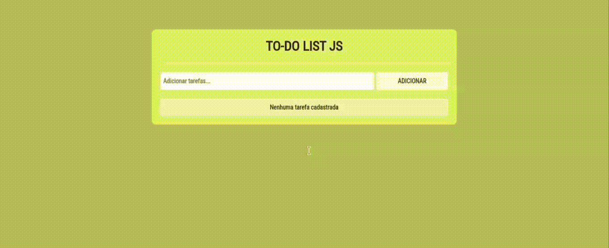

# TO-DO LIST JS

### 💻 Sobre o projeto

- To-Do List JS - é um projeto desenvolvido para praticar o básico das tecnologias HTML, CSS e JAVASCRIPT, usando tambem a manipulação de arrays.

- Inspirado em uma dica de lista de projetos para o portifólio com um design básico para mostrar o funcionamento de uma lista de tarefas.

### 🎨 Layout

- A baixo o design da aplicação em execução.

  

### 🛠 Tecnologias

- As seguintes ferramentas foram usadas na construção do projeto:

- HTML
- CSS
- JAVASCRIPT

### 📝 Licença

- Fique a vontade para contribuir...

- Feito com ❤️ por Irani Junior 👋🏽